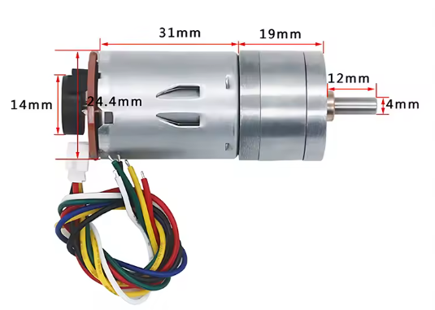
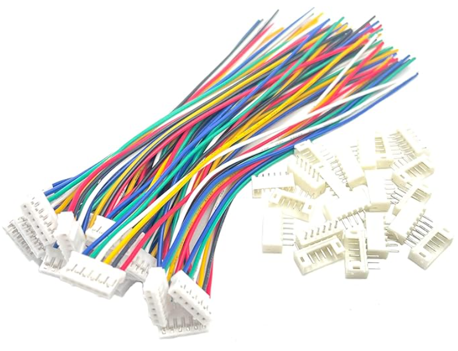
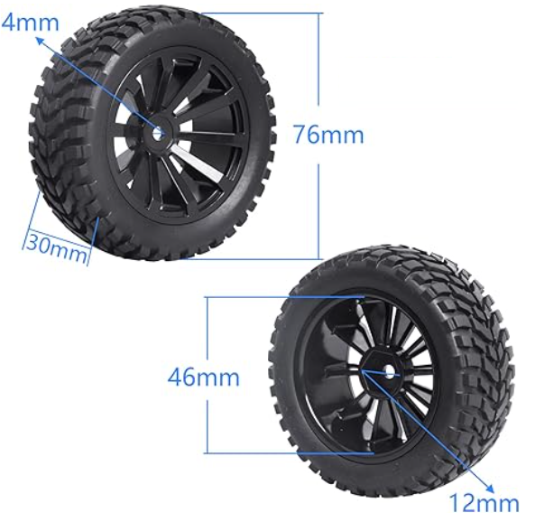
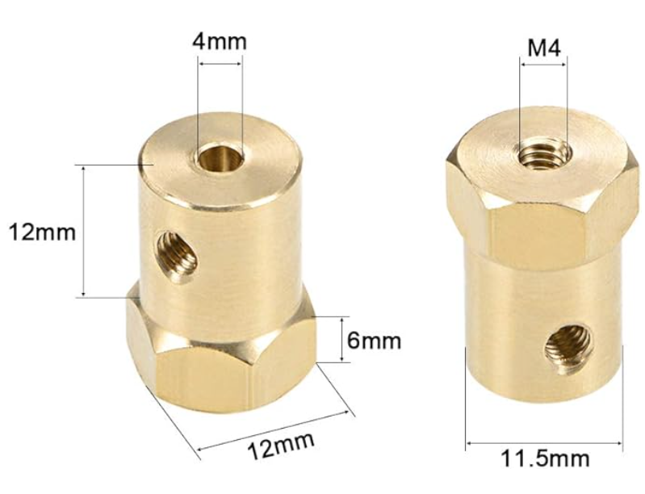
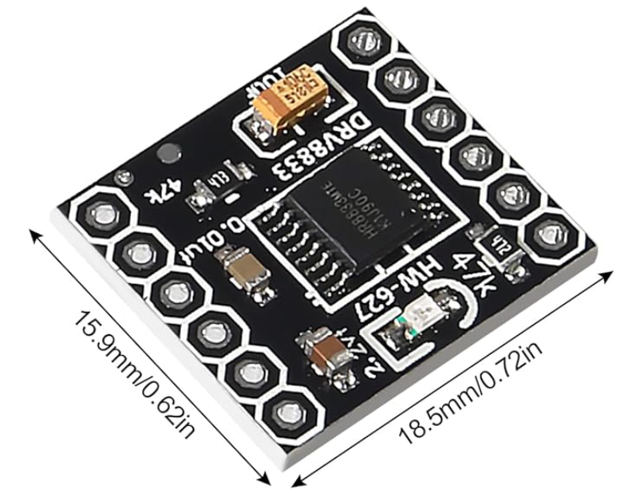
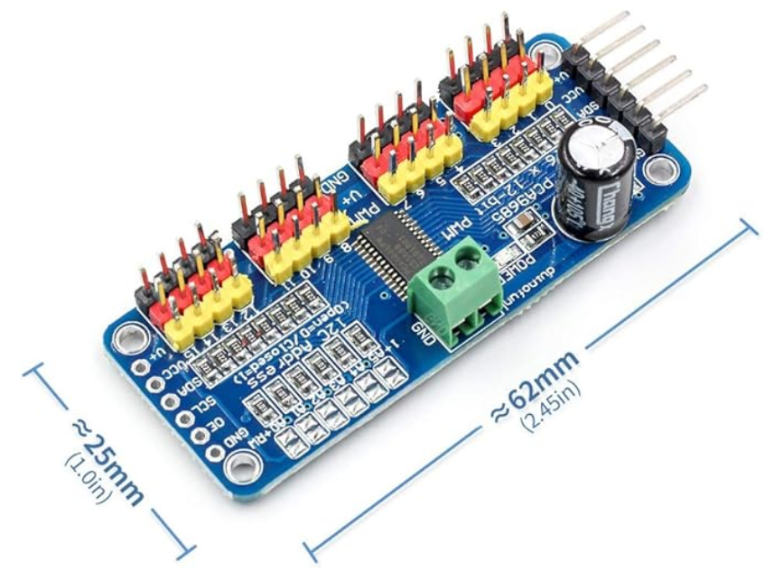
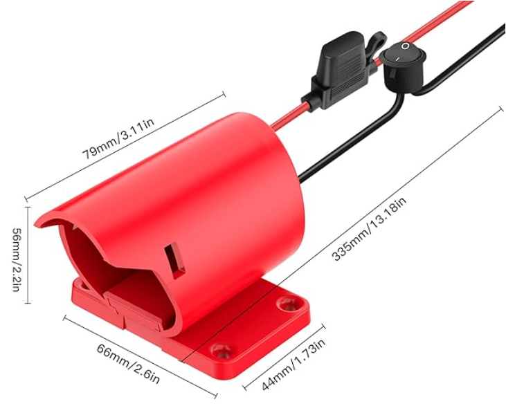
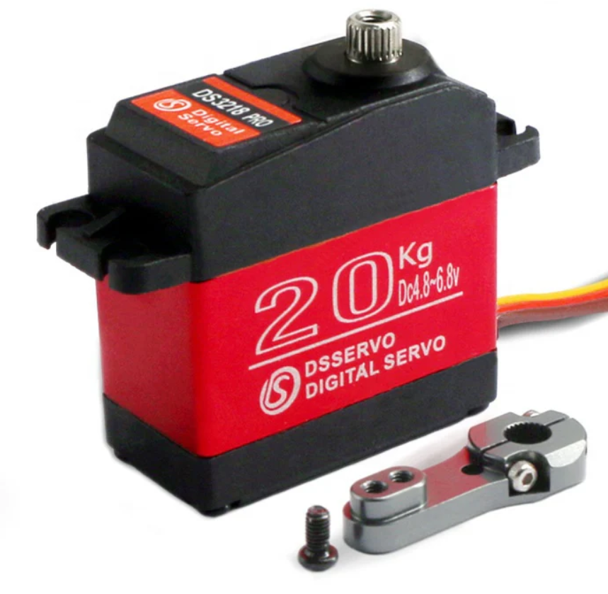
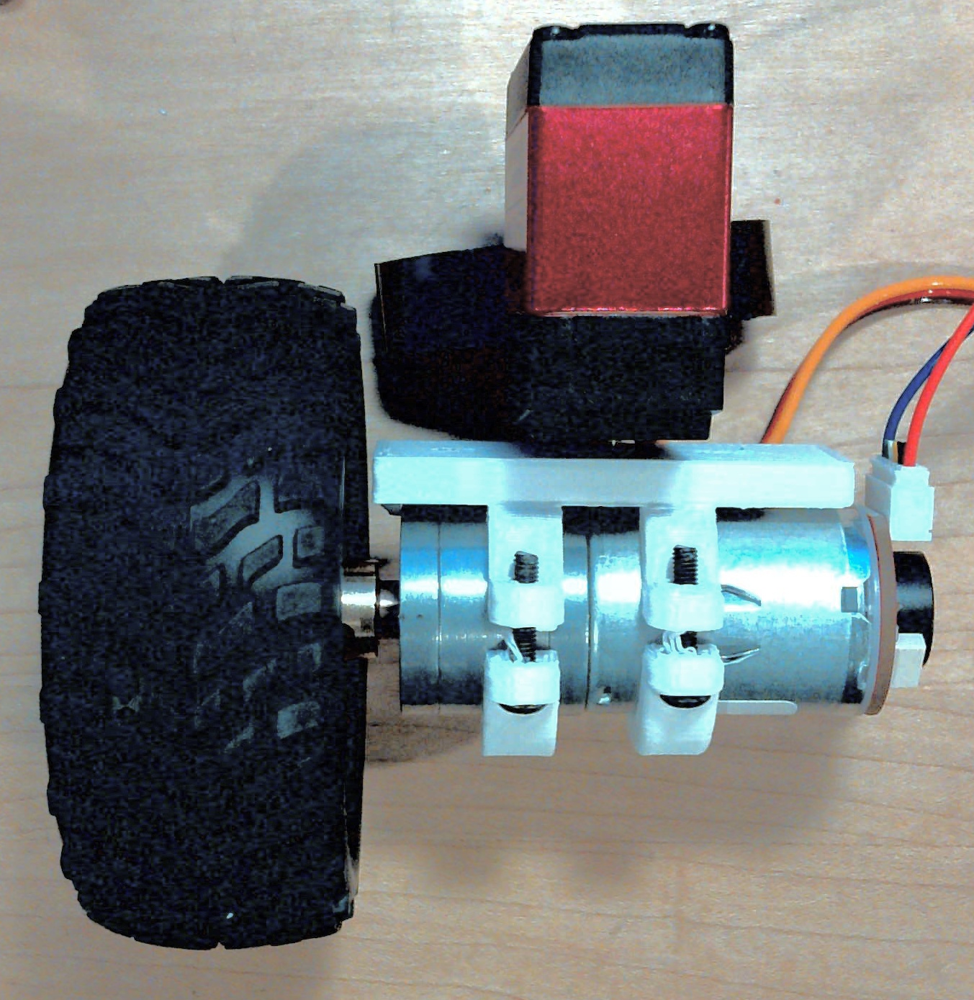
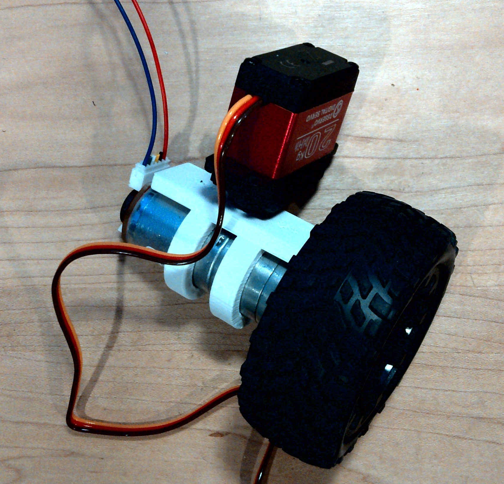

# YoshiBot Bill of Materials

Note: This is very preliminary right now

Quantities required depends on the configuration.

You need 1 DRV8833 for each 2 driven motors.
You need 1 DS3218 servo for each driven motor.

## General Parts List

| part | Part Number | Description | Cost | Source | Image |
| --- | --- | --- | --- | --- | --- |
| Motors | JGA25-370 | 6V 130RPM | $4.50 | [Ali Express](https://www.aliexpress.us/item/3256806027674487.html) | 
| Motor Cable | JST PH2 | 6-position | $1 | [Amazon](https://a.co/d/dRmRub8) |  |
| Wheel/Tire | n/a | 76mm 12mm Hex | $4 | [Amazon](https://amzn.to/3BXqyhx) |  |
| Shaft Coupler | n/a | 4mm bore, 12mm hex | $2 | [Amazon](https://amzn.to/428gFYW) |  |
| Motor Drive | DRV8833 | 1.5A drive | $1.20 | [Amazon](https://amzn.to/3Pu1j9F) |  |
| PWM Generator | PCA9685-based | ?? | $7 | [Amazon](https://amzn.to/4gRtkUQ) |  |
| Battery Adapter | n/a | Milwaukee M12 | $9 | [Amazon](https://amzn.to/4fLFsFf) |  |
| Steering Servo | DS3218MG (MS24) | Metal gear servo | $12.50 | [Amazon](https://amzn.to/4jsscsl) |  |

## Drive Motor Assembly

Drive motor assemblies provide drive and steering for a rover.  Quantity required depends on configuration.

 

| Qty | part | Part Number | Description | Image |
| --- | --- | --- | --- | --- |
| 1 | Motors | JGA25-370 | 6V 130RPM | 
| 1 | Motor Cable | JST PH2 | 6-position |  |
| 1 | Wheel/Tire | n/a | 76mm 12mm Hex |   |
| 1 | Shaft Coupler | n/a | 4mm bore, 12mm hex |  |
| 1 | Steering Servo | DS3218MG (MS24) | Metal gear servo |  |
| 2 | Self-tapping screw | M1.7 x 6mm | |
| 2 | Machine screw | M3 x 16mm | |
| 2 | Nut | M3 | | 