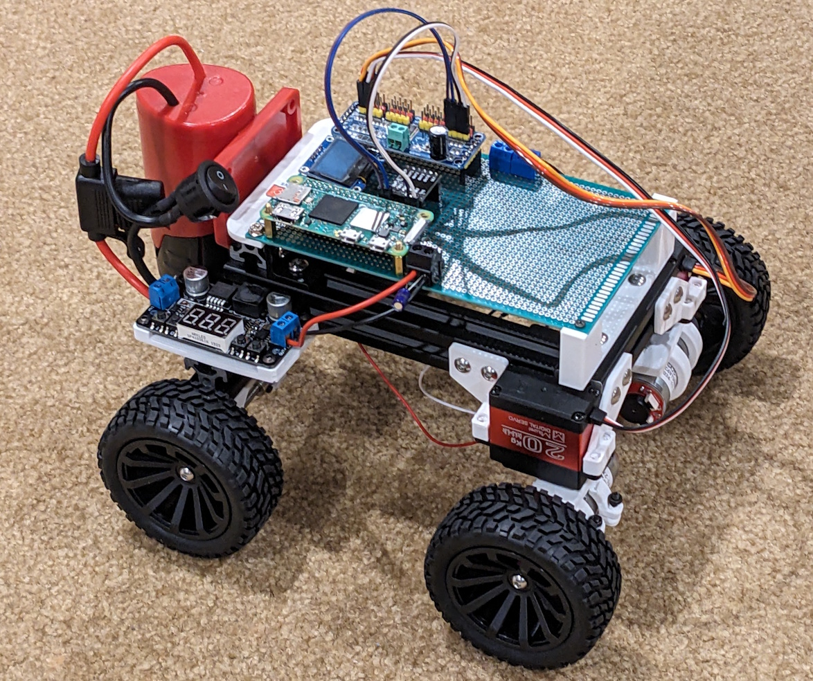
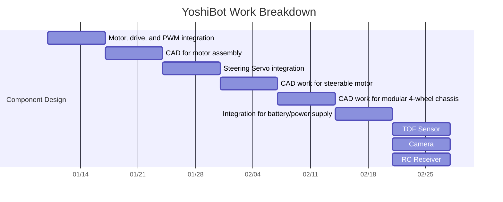

# YoshiBot

The YoshiBot is an open-source, modular, robotic rover learning platform driven by a Raspberry Pi Zero 2W.  The goal is to create a low-cost, configurable kit that allows anyone to assemble a wheeled rover for a wide variety of applications.

The current goals are to create chassis configurations for:

- YoshiBot 3W: a 3-wheeled introductory platform.  2 drive wheels and a caster.
- YoshiBot 4W: a 4-wheeled general platform.  2 drive wheels and 2 idle wheels.  Steered with the driven wheels (i.e. front wheel drive)
- YoshiBot 4AW: a 4-wheeled general platform. All 4 wheels driven.  Steering with 2 wheels.
- Yoshibot 6W: a 6-wheeled, bogey-beam suspension, advanced platform.  6 drive wheels, steering with 4.

## Project Schedule

This is a volunteer project, so the schedule is very loose.  Consider the "schedule" more as a list of tasks that need doing and in what order, the dates being very rough guesses at best.  If you'd like to volunteer, great!  We'd love help.  If you'd like to donate, it certainly will help.

## Bill of Materials

[Available here](Docs/bom.md)